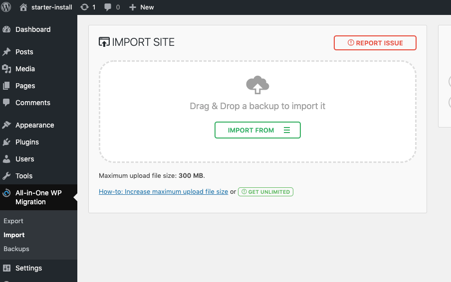

Welcome to our documentation, you can find here the general documentaion that apply to all of our themes!

in the other sections you will find the documentation specific to themes, plugins and starters

# 🚀 All that you need to get it running.

## Setting up your WordPress Website.

You will need a running WordPress installation. Gatsby fetches the data from your WordPress website.

### Automated way

- Make a wordpress fresh installation on your hosting
- Install the free plugin https://wordpress.org/plugins/all-in-one-wp-migration/
- Import the package corresponding to the theme you are planning to use (all of our a themes work with the same parent theme, and each theme work with a specific child theme)

  

- Login with admin / gatsbyWpThemes
- Create a new user with secure credentials and delete the admin one
- Configure your settings
- that's it!
- it includes some dummy post and pages to guide you

### Manual way

- Install the required themes: the gatsby-wp one, and the child theme corresponding to the gatsby theme you want to use.(they are all in the package that you have received in your welcome mail)
- Install the required plugins

  - [WPGatsby](https://github.com/gatsbyjs/wp-gatsby)
  - [WPGraphQL](https://github.com/wp-graphql/wp-graphql/tree/release/v0.9.1)

* <strong>Permalinks structure</strong>

  In order that the plugin works correctly, your WordPress installation must
  have pretty permalinks enabled (commonly oprovided by the majority of hosting
  servives). Also, The permalink structure **must not** be the default (plain,
  `http://example.com/?p=123.`) WordPress permalink structure. This can be done
  via your WordPress admin area in Settings > Permalinks.

## Setting up your Gatsby Site.

### Set Up Your Development Environment

go to [Gastby documentation](https://www.gatsbyjs.org/tutorial/part-zero/) and prepare your computer

### Installing your Gatsby starter

Choose the starter you want to use among the ones you have received inside your welcome mail

- If you are going to build something totally custom, we recomend using the starter data one: it looks exactly like the starter, but only the the gatsby-theme-blog-data is installed as theme, all the code from the gatsby-theme-wp-blog-starter is in the site, so you can modify everything easely without shadowing

1. Unzip your starter.
2. Open the `.nprmc` file and replace `YOU_SECRET_API_KEY` string by your token that you can find in your welcome mail
3. Run `yarn` command from your starter directory, in order to install all the npm modules
4. [Configure your Gatsby site.](#gatsby-config) Most importantly, provide the url of your WordPress source website.
5. Run `gatsby develop` to [start the developement server](https://www.gatsbyjs.org/docs/gatsby-cli/#develop)

### Configure your Gatsby site - config.js

In order to setup your Gatsby website, you will need to edit his configuration file, `config.js` located in the root of your project.

The default options are listed below.
We discuss each one in details in the Options section.

```javascript
const config = {
  wordPressUrl: ``,
  uploadsPath: `wp-content/uploads`,
  pathPrefix: "",
  postsPath: ``,
  paginationPrefix: `page`,
  addWordPressComments: true,
  addDisqusComments: false,
  menuName: "main",
  siteUrl: "https://example.com",
  title: `Blog Title Placeholder`,
  author: `Name Placeholder`,
  description: `Description placeholder`,
  social: [
    {
      name: `twitter`,
      url: `https:twitter.com/gatsbyjs`,
    },
  ],
  twitterSummaryCardImage: `Gatsby_Monogram.png`,
  fonts: ["Abril Fatface", "Fira Sans"],
  gaTrackingId: 0,
  googleTagManagerId: 0,
  addSiteMap: false,
  siteMapOptions: {},
  addFancyBox: true,
  skipTitle: [],
  mailchimpEndpoint: "",
}
```

### Options

**wordPressUrl** (required)
Provide a url to your WordPress source website

---

**uploadsPath** (optional)
`(default: wp-content/uploads)`

A relative path to your uploads directory. `wp-content/uploads` is default for any WordPress installation.
Unless you redefined your uploads destination, skip this setting.

---

**pathPrefix** (optional)
`(default: "")`

Typically, your Gatsby website will be hosted at the root of its domain. In that case, the pathPrefix is an empty string and you can skip this setting.
You will need to set the pathPrefix though, if your gatsby website is hosted at something other than the root (/), for example `https://example.com/demo`

Adding the path prefix requires two steps:

1. setting the pathPrefix (make sure to preceed it with a slash)
   example:

```javascript
pathPrefix: "/demo"
```

2. You have to add `--prefix-paths` flag when building your website:

```bash
gatsby build --prefix-paths
```

---

**postsPath** (optional)
`(default: "")`

This is an important setting. It should reflect your WordPress _Reading > Your homepage_ displays settings, otherwise your Gatsby website may not work properly.

That is:

- `postsPath` should be left empty if your WordPress homepage displays your latest posts. This corresponds to the default in Settings > Reading > Your homepage displays.

- If you chose a static page and set a Posts page, you should use the Posts page slug as your `postsPath`.

- If your WordPress website doesn't display blog page (homepage displays a static page and Posts page is not defined), you should set `postsPath` to `false`.

example:

```javascript
postsPath: "blog"
```

or

```javascript
postsPath: false
```

In the future, this setting will be removed. The WordPress Reading Settings > Your homepage displays will be used automatically.

---

**paginationPrefix** (optional)
`(default: 'page')`

Prefix for paginated content.

What is the url structure of any paginated content on your WordPress website? By default, WordPress uses `page` as the prefix, that means it preceeds page numbers by the `page` keyword (`page/2`, `page/3`, ...).
You should skip this setting, unless your changed the pagination url format on your WordPress site.

---

**addWordPressComments** (optional)
`(type: Boolean, default: true)`

Whether WordPress comments should be activated.

If left `true`, the comments will be displayed for posts that have comments status set to "Allow Comments".
Commenting on your Gatsby site work similarily to commenting on your WordPress site. The main difference is that **we only support two levels of comments nesting.** Under the hood, comments are fetched from WordPress and updated on WordPress (and refetched if necessary) with Apollo Client. Consequently, some of your WordPress Discussion settings applies to your Gatsby comments, in particular: email notifications, moderation and blocking rules.

---

**disqus** (optional)

Whether Disqus comments should be activated.

Alternatively to comments powered natively by WordPress, our themes supports [Disqus comments.](https://disqus.com/)
To activate Disqus comments go to the .env file at the root of your project, uncomment GATSBY_DISQUS_NAME, and add your Disqus shortname (the unique identifier fo your website on Disqus.
Disqus comments will be activated for all posts

---

**menuName** (optional)
`(type: String, default: "main")`

The WordPress name of the navigation menu that will be used.

You can choose any of the menus that you had created on your WordPress site by passing its name to the **menuName** option.


example:

```javascript
menuName: "Main Menu"
```

---
