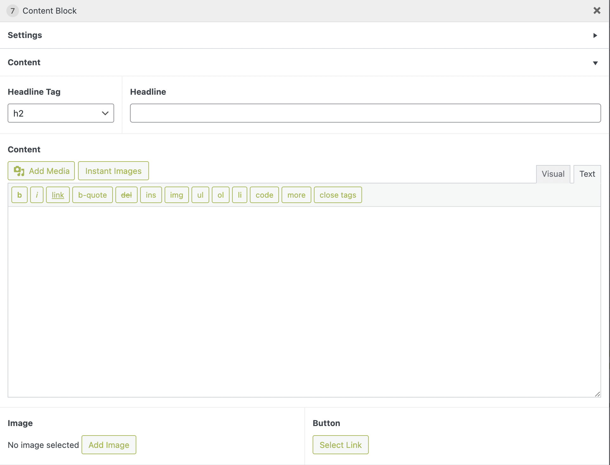

## Elements
 - Headline tag
 - Headline
 - Content: wysiwyg editor
 - Image
 - Button: Link field
## Usage
Use it for any simple content layout, you can use all the elements, as well as only one of them, for example, an image.
