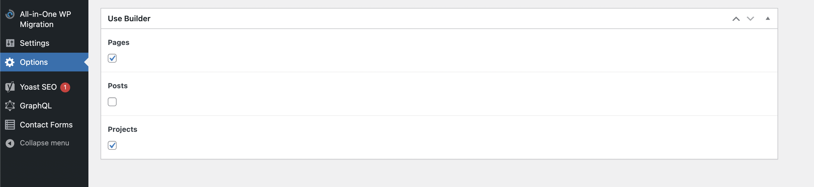
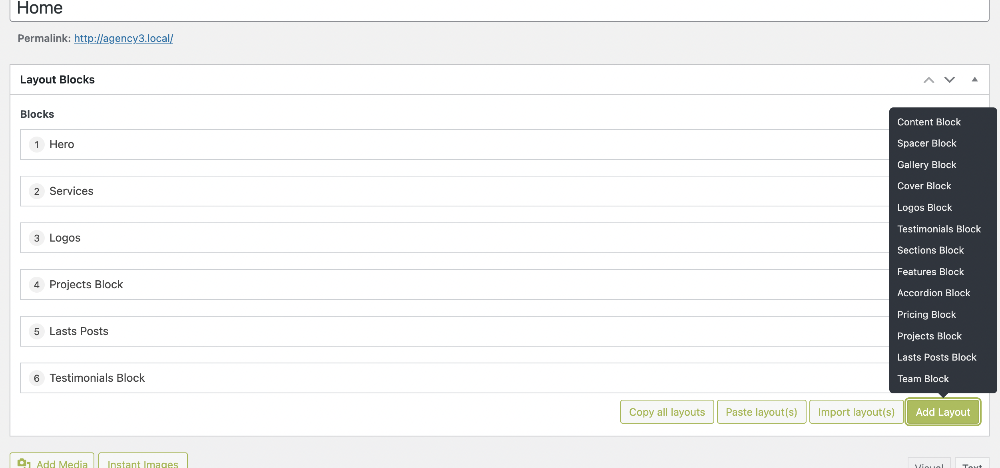
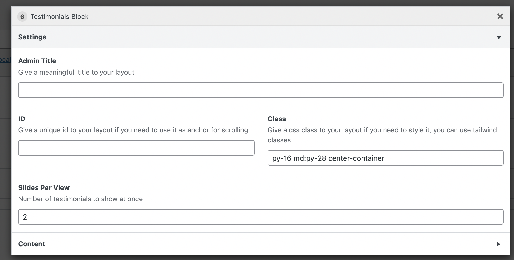

Our new themes include the HeadlessWP-pro parent WordPress theme which bundles ACF pro, and power a builder that is driven by @gatsbywpthemes/gatsby-theme-acf-builder on the Gatsby side and ACF Flexible Content on the WordPress side.
With the help of this builder, you can create nearly any kind of layout!

## configuration
You can choose where to use the builder and where to use the WordPress editor.

Go to Options and the back-office and select where you want to use it.

By default, it's activated on pages and projects and deactivated on posts.

Even if it's unchecked, it will appear in the WordPress back-office but will be deactivated on the Gatsby side.


## plugins
All these plugins are pre-installed if you use the automated way, but you will need to install them if you choose the manual way
### mandatory plugins
In addition to the other mandatory plugins, you will need this one to expose the custom fields to WPGraphQL
<a href="https://www.wpgraphql.com/acf/" target="_blank" rel="noopener noreferrer">WPGraphQL for Advanced Custom Fields</a>

### Recommended plugins
This plugins will make your experience more enjoyable
<a href="https://wordpress.org/plugins/classic-editor/" target="_blank" rel="noopener noreferrer">Classic Editor</a>

- Our builder doesn't play very well with Gutenberg, this plugin allows you to choose which editor you want to use for each post.

<a href="https://wordpress.org/plugins/acf-flexible-layouts-manager/" target="_blank" rel="noopener noreferrer">ACF Flexible Layouts Manager</a>

- This WordPress plugin allows you to easily manage your layouts in the Advanced Custom Fields “Flexible Content”.
- You can copy/duplicate any layout & import partials/full layouts from post/page.


<a href="https://wordpress.org/plugins/acf-flexible-content-modal/" target="_blank" rel="noopener noreferrer">ACF Flexible Content Modal</a>

- Edit ACF flexible content layouts in a Modal window.
- Warning: This plugin doesn't work if Gutenberg is activated.


## Usage


- Choose the layout that you want to use.
- You can drag and drop layouts on the page.
- Click on the pen icon to open the layout.
- For each layout you will find 2 accordions tabs:
   #### Settings

Here you can:
- give an admin title to your layout
- Give a unique ID, if you need to use it as an anchor for scrolling
- Give a class to style it differently:
 you can also use tailwindcss classes, in this case, you will need to have them in your tailwind.config.js safelist, otherwise they will be purged by tailwindcss

 ``` javascript title="taiwlwind.config.js"
   safelist: [
    "md:py-20",
    "py-10",
    "py-18",
    "py-16",
    "md:py-28",
    "pt-16",
    "md:pt-28",
  ],

 ```
 #### Content
 
 Here you can enter the specific content for each layout, and sometimes have styling classes for repeating elements.
