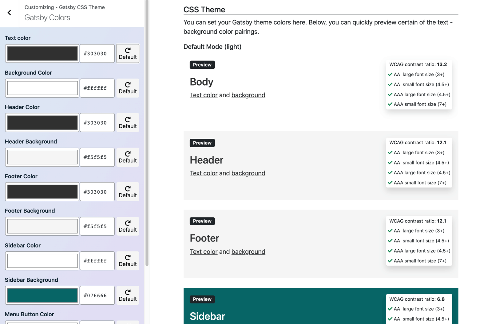

## Setting Colors via WordPress Customizer

Depending on the starter, you might have the possibility to set up the Gatsby Colors Theme via WordPress Customizer.  
The configuration comes with a color contrast checker for the page elements that have customizable both text and background colors.



If your Gatsby theme supports dark mode, you can also configure dark mode colors via our Customizer.

## Setting Colors in `.js` configuration file

Color can be also set in the `configColors.js` file in the root of your starter.

```js title="configColors.js"
const colorSettings = {
  text: "#5c4e67",
  bg: "#fbf8f8",
  modes: {
    dark: {
      text: "#ffffff",
      bg: "#5c4e67",
    },
  },
}
```

Depending on the Gatsby theme of your starter, your WordPress Headless WP child theme may add color settings to the Customizer. If your WordPress theme adds color settings via Customizer, the WordPress values override tha values from the `config.js` file. That means that you have to add `overrideWPColors: true` to your `config.js` file.

```javascript title=config.js
const config = {
  // ...
  overrideWPColors: true,
}
module.exports = config
```
