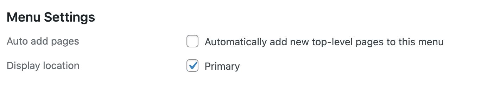

Your WordPress website provides the content for your Gatsby website. Beside publishing some posts and pages you can also customise your website structure.

A number of the "core" WordPress settings are fetched by Gatsby and used by our themes.

## Settings > General

In the General Settings tab in your WordPress Dashboard, you will configure

- Site title
- Tagline
- Administration Email Address (this email will be used as a send-to email for your contact form)
- Site Language
  > Please note that for the moment, our themes are available only in English.

## Settings > Reading

In the Reading Settings tab you can define

- what your homepage displays, the homepage static page and the posts page if applied
- the number of posts displayed per blog/archive pages

## Settings > Discussion

Under the hood, comments are fetched from WordPress and updated on WordPress (and re-fetched if necessary) with Apollo Client.  
Consequently, most of the settings in this tab apply to the Gatsby comments, in particular: email notifications, moderation, and blocking rules.  
On the other hand the "Other comment settings" or "Avatars" are not taken into account.

To globally disable support for WordPress comment, see [WordPress Theme Options > Add WordPress Comments.](/configuration/wp#general-features)

## Settings > Permalinks

🚫 The permalink structure **must not** be the default plain one, like that : `http://example.com/?p=123`.

> That also means that your WordPress installation must have pretty permalinks enabled. Most hosting services provide support for pretty permalinks so this is rarely an issue.

## Menus

Your WordPress menu is fetched by Gatsby. Just make sure to check the Display location field.

  

> If, for some reason, you are not using our Headless WP WordPress theme, please make sure that your menu location is `PRIMARY`.
