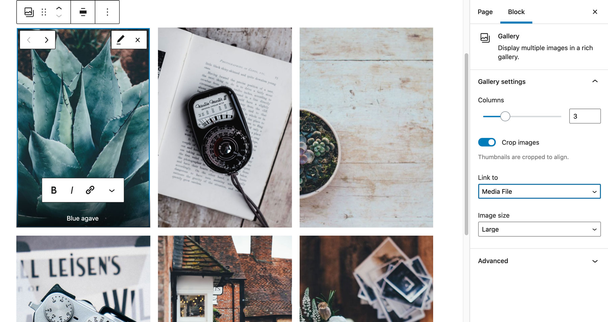
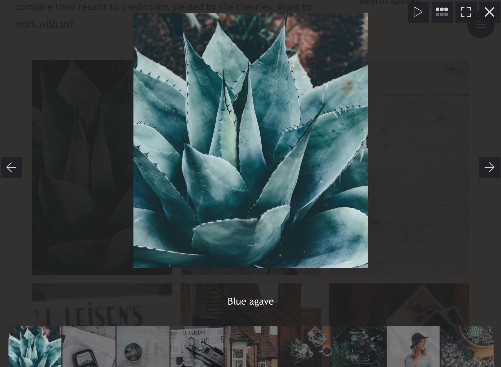

Our themes have built in support for lightbox galleries (galleries that open a modal slideshow when one of the images is clicked).

## On the WordPress side

The lightbox functionnality is activated for galleries that have the **"Link to"** Gallery Block setting pointing to **"Media File."**



If you add a caption to an image - it will be displayed under the image in the lightbox mode (the captions are displayed _only_ in the lightbox mode). If no caption is provided, the image alternative text will be displayed.



## Customizing your lightbox gallery

Under the hood we use the [`simple-react-lightbox`](https://github.com/michelecocuccio/simple-react-lightbox) plugin. You can use the [`simple-react-lightbox` options](https://simple-react-lightbox.dev/documentation/options) by passing them to `config.lightboxOptions` in your starter `config.js` file.

```js title=config.js highlight={3-15}
const config = {
  // ...
  lightboxOptions: {
    settings: {
      overlayColor: "rgb(25, 136, 124)",
    },
    buttons: {
      backgroundColor: "#1b5245",
      iconColor: "rgba(126, 172, 139, 0.8)",
    },
    caption: {
      captionColor: "#a6cfa5",
      captionTextTransform: "uppercase",
    },
  },
}
module.exports = config
```

> The Download functionnality is not supported, and the `showDownloadButton: true` setting will not be retained.

## Deactivate lightbox

If you don't need this feature and want to optimize your bundle size, you can deactivate lightbox modals.

<div class="steps">

1. Create a `gatsby-plugin-wordpress-lightbox` folder in your starter `src/@gatsbywpthemes`.
2. Create a `LightboxWrapper.js` file in the `src/@gatsbywpthemes/gatsby-plugin-wordpress-lightbox` folder

   ```bash highlight={7,8}
   .
   ├── config.js
   ├── ...
   ├── package.json
   ├── src
   │   ├──
   │   │   ├── 🆕 gatsby-plugin-wordpress-lightbox
   │   │   │   └── 🆕 LightboxWrapper.js
   │   │   └── gatsby-theme-wp-ginger-chakra
   │   │       ├── chakra
   │   │       ├── components
   │   │       └── utils
   │   └── styles
   └── static
   ```

3. Add the following code to your new `LightboxWrapper.js` file

   ```javascript title=src/@gatsbywpthemes/gatsby-plugin-wordpress-lightbox/LightboxWrapper.js
   import React from "react"
   const LightboxWrapper = ({ children }) => <>{children}</>
   export default LightboxWrapper
   ```

</div>
