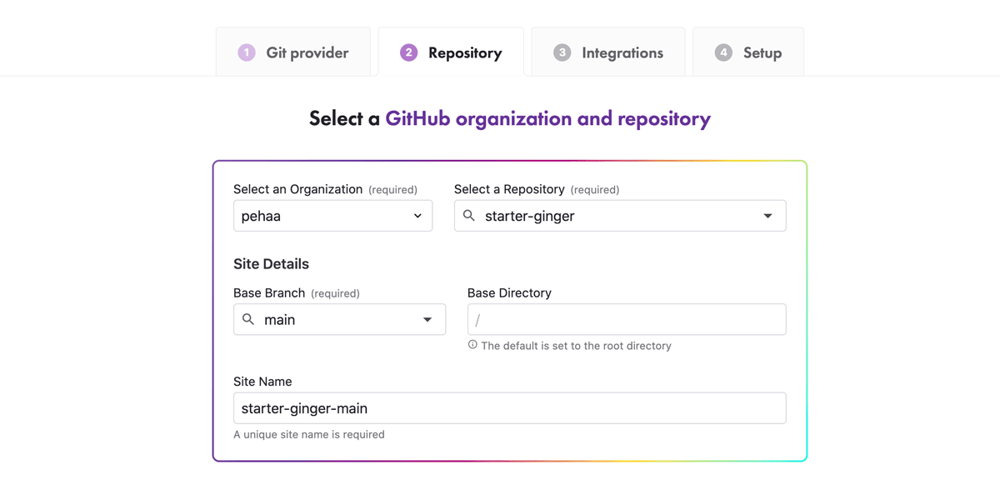

[The Gatsby documentation](https://www.gatsbyjs.com/docs/deploying-and-hosting/) explains in details the deployment process. You will find there a variety of possibilities.  
You should definitely consider deploying on [Gatsby Cloud](https://www.gatsbyjs.com/products/cloud/), the cloud platform specifically built by Gatsby for the Gatsby framework.

Right below, we will describe step-by-step the deployment process on [Gatsby Cloud](https://www.gatsbyjs.com/products/cloud/) and [Netlify.](https://www.netlify.com/)

In both cases you need to have a remote repository for your project. Your repository can be private or public. We'll use GitHub here.

> ✅ Given that our starters require `yarn` to work, make sure to **have `yarn.lock`** in your starter's GitHub repository. The `yarn.lock` file is automatically added when you first install your dependencies with the `yarn ` command.

## Deploying on Gatsby Cloud

1. Sign-up to Gatsby Cloud with your GitHub account.
1. Click the **Add a site +** button on your Dashboard.
   
1. Choose the **Import from a Git repository** option
   
1. Select your Git provider, GitHub in our case. Then selecto the starter's repository.

   > You will have to authorize Gatsby Cloud to access your respository. (You can always modify the configuration in your [GitHub Settings Installations](https://github.com/settings/installations))

   

1. Skip the integration step
1. Gatsby Cloud list the environmental variables that were automatically detected. Make sure to fill in the the value for the required `GATSBY_WP_URL`.
   You also have to provide your secret auth token `GWPT_AUTH_TOKEN` here.
   

## Deploying on Netlify

1. Sign-up to Netlify with your GitHub account.
2. Click the **New Site from Git** button
   
3. Choose your Git provider, GitHub in our case.
   
4. Choose your GitHub repo (you will need authorize Netlify to access it).
   
5. In the configuration screen, choose:
   - your branch to deploy - each time you push to this branch, your site will be rebuilt
   - the build command: `yarn build` (or `gatsby build`)
   - your publish directory: `public`
   - open the **Advanced build settings** panel to add your environment variables. Paste all the variables you set in your `.env` file as well as the secret auth token `GWPT_AUTH_TOKEN`.  
     Your build requires two environment variables `GWPT_AUTH_TOKEN` and `GATSBY_WP_URL`.
     
6. Click the **Deploy site** button, the process can take a few minutes.
7. Finally in **Site settings** > **Domain management** you can change the subdomain (by default it's some random string like modes-gates-51b250). You can also add your own custom.
   

