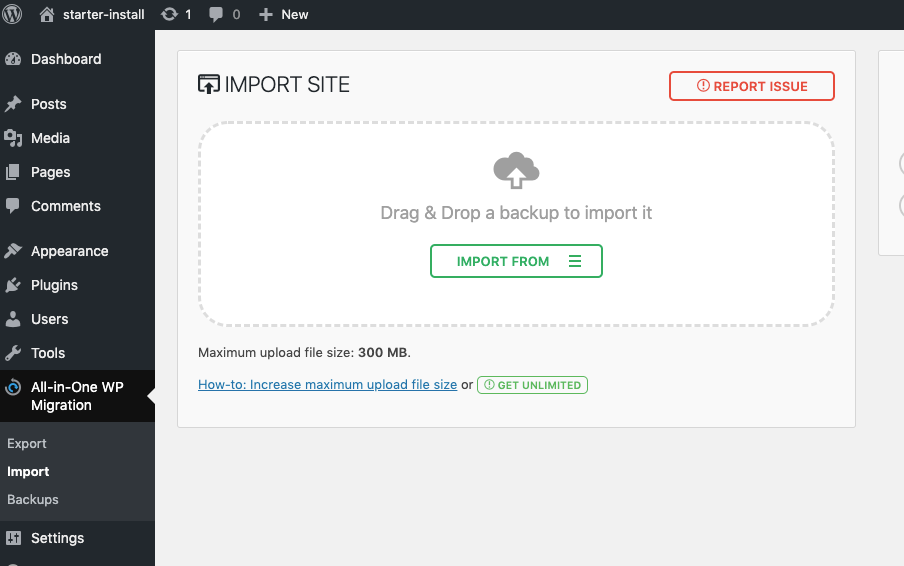

Your content comes from your WordPress website. That means you will need a running WordPress installation.
Your WordPress website requires some initial configuration to expose the data in the right format for Gatsby.

## Automated way

The easiest way to set up your WordPress site is by installing a pre-configured, ready-to-use website from the `.wpress` file available in the starter of your choice.

> If you already have some WordPress content that you don't want to lose, the _automated way_ is not a good option. The new installation will override your database. Please refer to the [Manual way section.](#manual-way)

Each Gatsby starter comes with a `.wpress` (WordPress) starter. The pre-configured WordPress installation contains all the required and recommended plugins as well as the recommended WordPress theme. More precisely, our WordPress starters use our generic **Headless WP** parent theme together with its starter-specific child theme.

You will also install some content (posts and pages) to start even more quickly.  
To have a quick all-in-one installation experience, you will use a free, third party WordPress plugin <a href="https://wordpress.org/plugins/all-in-one-wp-migration/" target="_blank" rel="noopener noreferrer">All In One WP Migration</a>.

1. Make sure to have WordPress installed on your hosting.
1. Install and activate _All-in-One WP Migration_ plugin. It is available in the official WordPress repo.
1. Click **Import** in the _All-in-One WP Migration_ menu.
1. The starter size may exceed the _Maximum upload file size_ available (this may vary depending on your hosting).  
   _All-in-One WP Migration_ gives you a few solutions here. An easy way to upgrade the import size to `512MB` is by [downloading and installing this add-on plugin.](https://import.wp-migration.com/all-in-one-wp-migration-file-extension.zip)
1. Chose **Import from File** and the `.wpress` package file corresponding to your Gatsby starter.
   {" "}
   
1. Our starter is now installed!
1. Log in to your website. You will have to use the following temporary credentials:
   - username: `admin`
   - password: `gatsbyWPThemes`
1. Go to **Settings > Permalinks** and save your permalinks structure (click the **Save Changes** button).
1. Create a new user with secure credentials, log in with your new credentials and delete the temporary admin account.
1. **That's it! Your WordPress website is ready for Gatsby.**

## Manual way

If you already have a WordPress website with some content you want to preserve, you will need to set it up manually.

1. Install the recommended WordPress themes:
   - the generic, parent theme **Headless WP**
   - the starter-specific child theme (for example **Headless WP Base Child**)
1. Activate the child theme
1. The theme will automatically check if the required and recommended plugins are activated
1. The theme provides a one-click plugins-installation. You can also install required and recommended plugins, as listed below, manually.

### Required plugins

- <a
    href="https://github.com/gatsbyjs/wp-gatsby"
    target="_blank"
    rel="noopener noreferrer"
  >
    WPGatsby
  </a> installed from the WordPress repository
- <a
    href="https://github.com/wp-graphql/wp-graphql/tree/release/v0.9.1"
    target="_blank"
    rel="noopener noreferrer"
  >
    WPGraphQL
  </a> - installed from the WordPress repository

### Recommended plugins

- <a
    href="https://wordpress.org/plugins/contact-form-7/"
    target="_blank"
    rel="noopener noreferrer"
  >
    Contact Form 7
  </a> - available in the WordPress repo

- <a
    href="https://wordpress.org/plugins/wordpress-seo/"
    target="_blank"
    rel="noopener noreferrer"
  >
    Yoast SEO
  </a> - available in the WordPress repo

- <a
    href="https://wordpress.org/plugins/add-wpgraphql-seo/"
    target="_blank"
    rel="noopener noreferrer"
  >
    Add WPGraphQL SEO
  </a> - available in the WordPress repo

- <a
    href="https://wordpress.org/plugins/code-syntax-block/"
    target="_blank"
    rel="noopener noreferrer"
  >
    Code Syntax Block
  </a> - available in the WordPress repo

### Permalinks structure

Your WordPress installation must have pretty permalinks enabled. (Most hosting services provide support for pretty permalinks so this is rarely an issue.) Also, the permalink structure **must not** be the default plain one, `http://example.com/?p=123`. You can modify the permalinks structure via your WordPress dashboard area in **Settings > Permalinks.**
